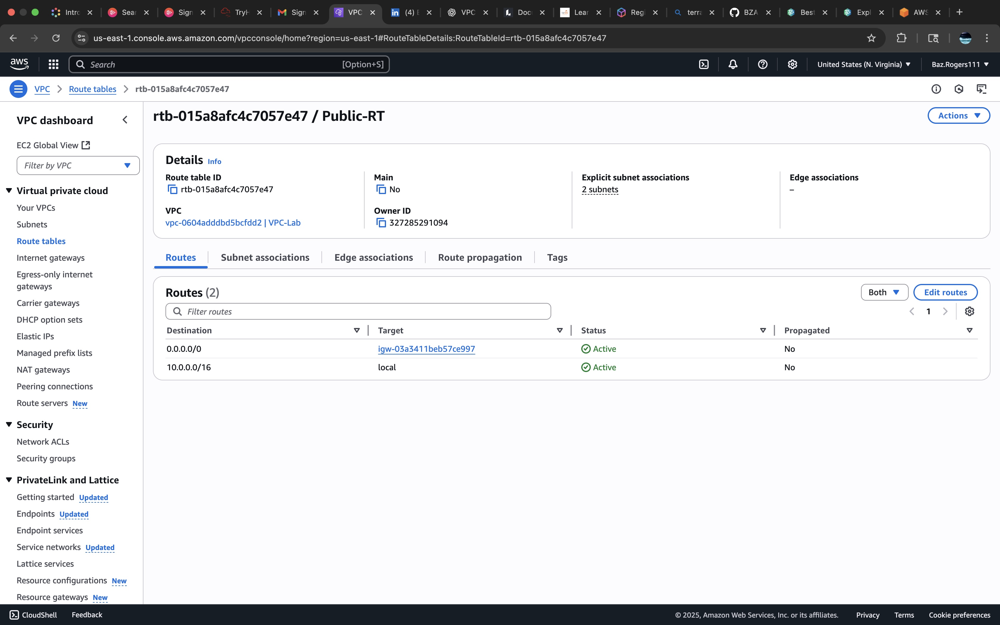
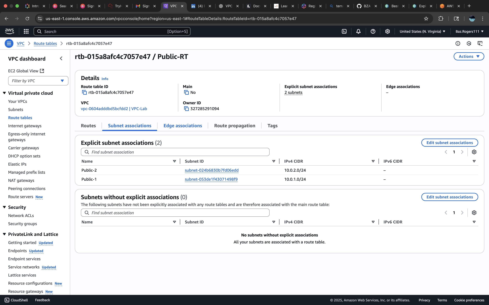
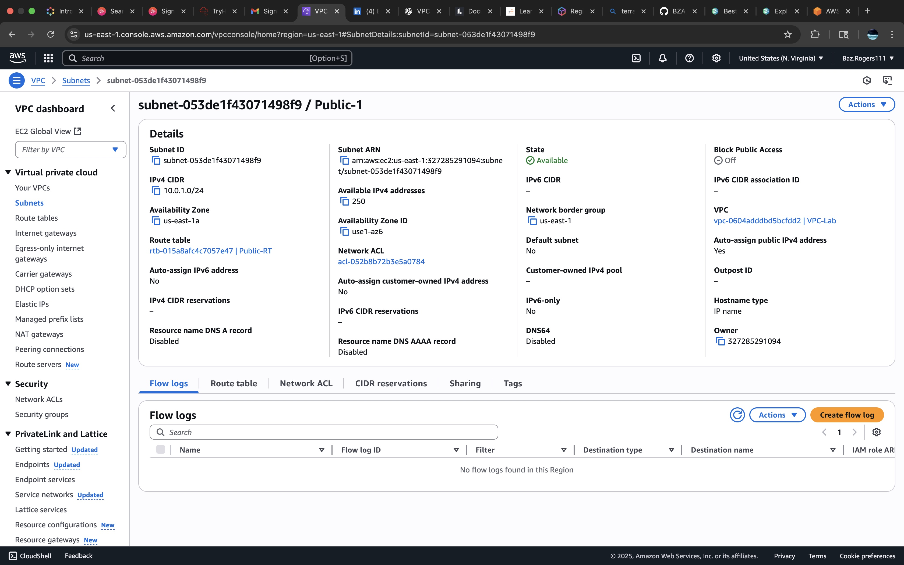
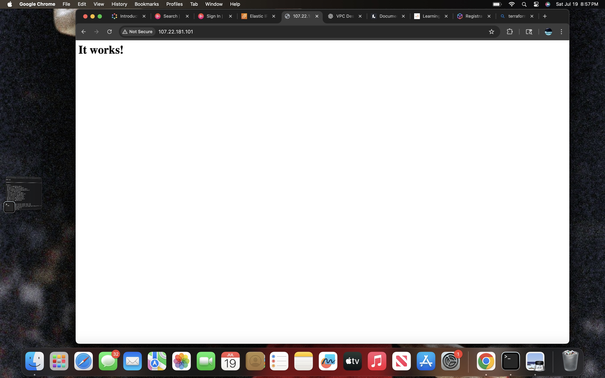
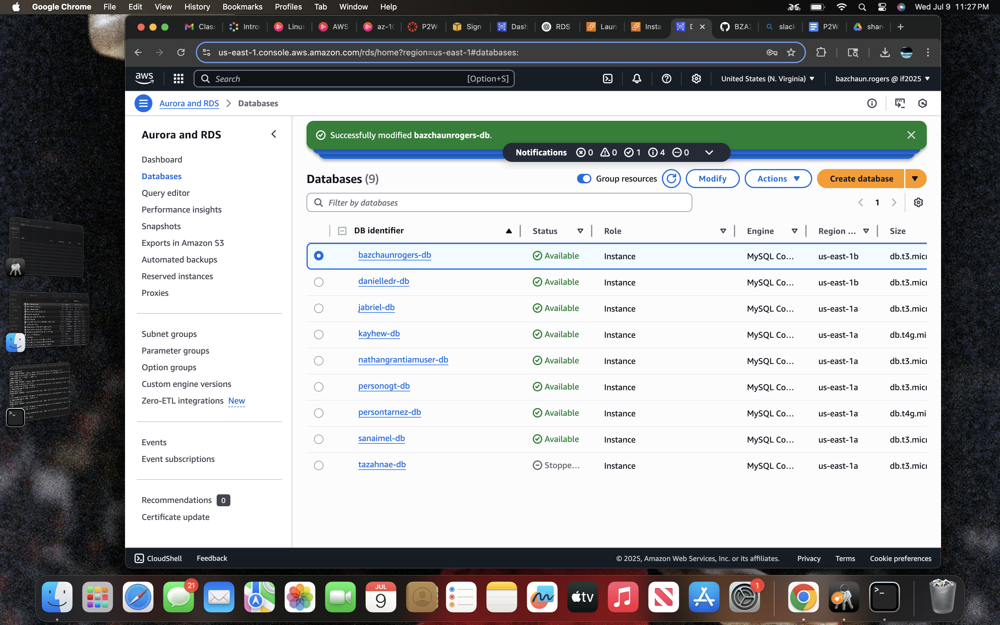

# EC2-Web-Server-Lab
Practice lab where I built and secured a web server on AWS EC2 — Elastic IP, hardened security groups, and Apache/Nginx manually installed.
# ⚡ Secure EC2 Web Server Lab

## 📝 Description
Hands-on AWS lab showcasing how to securely deploy a public-facing EC2 web server with hardened security groups, Elastic IP management, and manual installation of Apache or Nginx.

---

## 🎯 Objectives
- Launch a `t3.micro` EC2 instance in a public subnet.
- Attach an Elastic IP for persistent public access.
- Harden Security Group rules:
  - SSH (port 22) allowed from **my IP only**.
  - HTTP (port 80) allowed from **anywhere (0.0.0.0/0)**.
- Manually install and configure Apache or Nginx on Linux.
- Verify public web access.

---

## ✅ Skills practiced
=======
# ⚡ Secure EC2 Web Server Lab

Hands-on AWS practice lab where I deployed and secured a web server on an EC2 instance:
- Launched a `t3.micro` EC2 instance in a public subnet
- Attached an Elastic IP for persistent public access
- Hardened Security Group rules (SSH from my IP only; HTTP from anywhere)
- Manually installed and configured Apache or Nginx

## ✅ Skills practiced:
>>>>>>> c3668da (Add README.md with lab description and screenshots)
- AWS EC2 provisioning
- Elastic IP management
- Security Group hardening
- Linux administration
- Web server configuration

<<<<<<< HEAD
---

## 🔒 Security considerations
- Restricted SSH access for secure administration.
- Public HTTP access for external clients.

---
## 📸 Screenshots

=======
## 📸 Screenshots:

>>>>>>> c3668da (Add README.md with lab description and screenshots)
